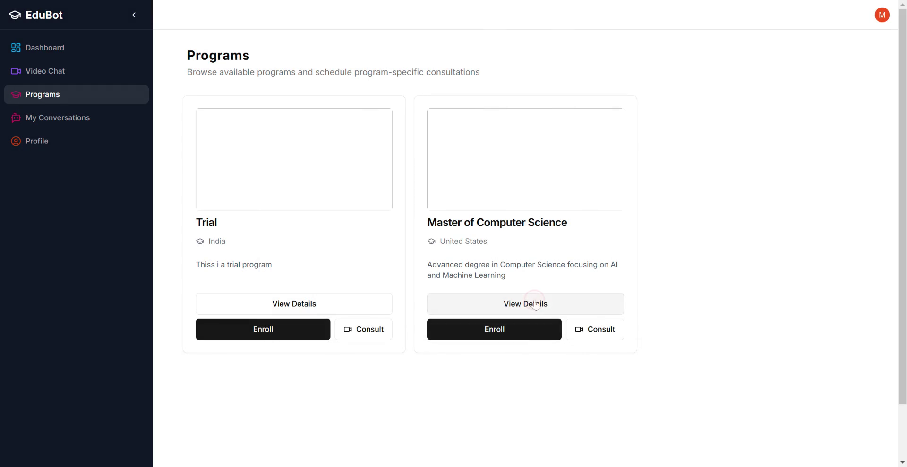
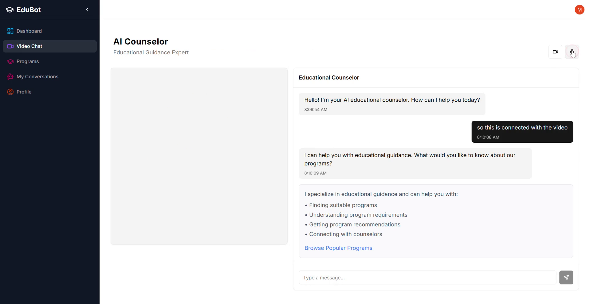
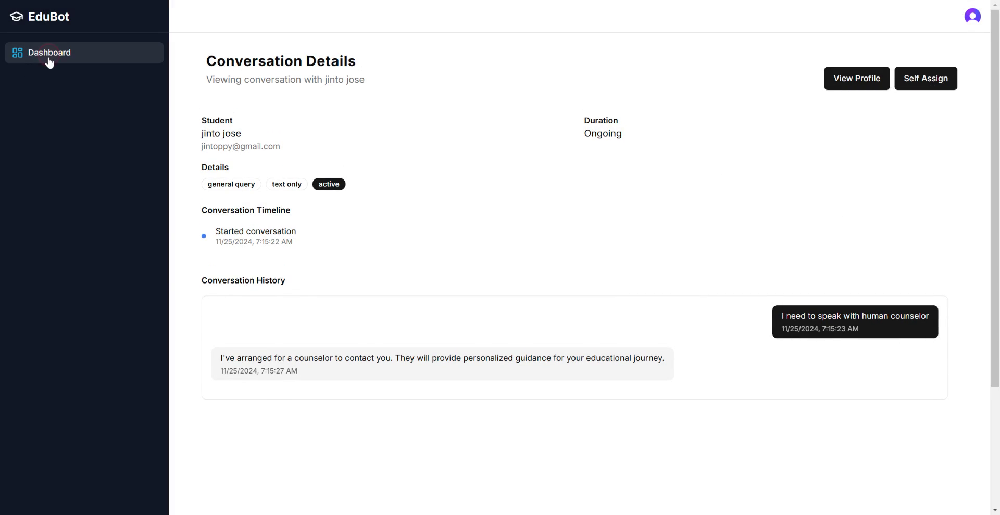

# AI-Powered Educational Video Bot

> This document outlines the process of navigating and utilizing an AI-powered video bot designed to facilitate human-like interactions and provide personalized guidance for international education. Users can log in as different roles—admin, student, or counselor—to perform specific tasks such as managing programs, viewing analytics, and engaging in consultations.

## Step 1

Log in to the platform to explore the AI-powered video bot, which offers human-like interactions and personalized guidance for international education. Students can access programs and interact with the bot.

## Step 2

Log in as an admin. The system supports three roles: admin, counselor, and student.

## Step 3

Enter your credentials to log in as an admin.

## Step 4

As an admin, you can access admin dashboard.

## Step 5

Admins have the ability to add programs, including details such as academic requirements.

## Step 6

Include additional details like language requirements and standardized tests. Admins can input all necessary information.

## Step 7

These details are already linked to the database for seamless integration.

## Step 8

View basic analytics and statistics to gain insights.

## Step 9

Review user conversations and access detailed information about each interaction.

## Step 10

Examine the content and duration of each conversation.

## Step 11

Admins can also add custom data, such as FAQs, Documentation on Visa processing etc.

## Step 12

Once added, the data's embeddings are incorporated into the vector store for improved response retrieval.

## Step 13

Log out and then log in as a student to explore different functionalities.

## Step 14

Successfully log in as a student to view available options.

## Step 15

Students can view all available programs within the application.

## Step 16

Access a history of conversations the user has engaged in.

## Step 17

Students have the option to update their profiles and access detailed program information.

## Step 18

Directly enroll in a program from this interface.

## Step 19

Initiate an enrollment request for a selected program.

## Step 20

Submit the enrollment request to proceed with the application.

## Step 21

Opt for a consultation or initiate a video chat session directly.

## Step 22

The system supports both video and audio functionalities for consultations.

## Step 23

if irrelevant question is asked, bot will not reply to that. Instead, return a Generative UI.

## Step 24

Utilize the platform for asking about a specific program, or a general question, or ask for recommendation etc. Also, can ask to connect to a Human counselor.

## Step 25

Log out and log in as a student counselor to access specific functionalities. Counselors can view user inquiries and details that have been requested.

## Step 28

Review previous user interactions and conversations.

## Step 29

Examine user details and allow the counselor to assign themselves to specific cases.

## Step 30

The counselor can manage and follow up on assigned cases effectively.

